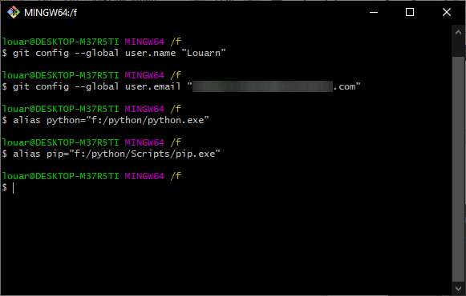
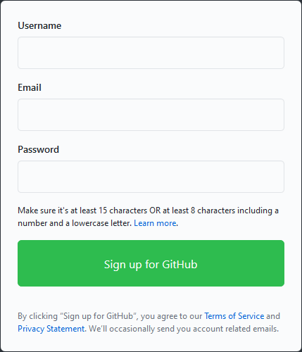
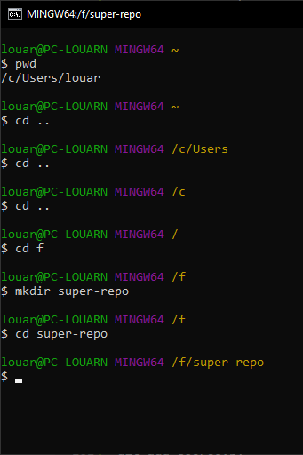
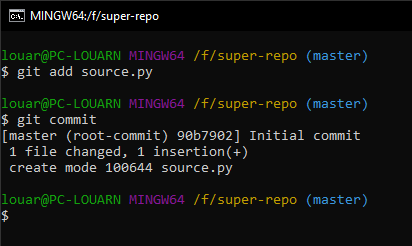
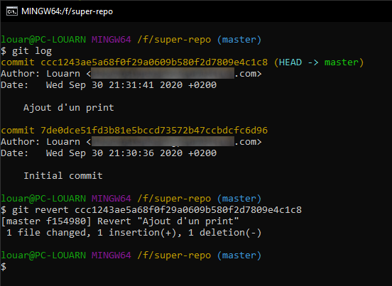
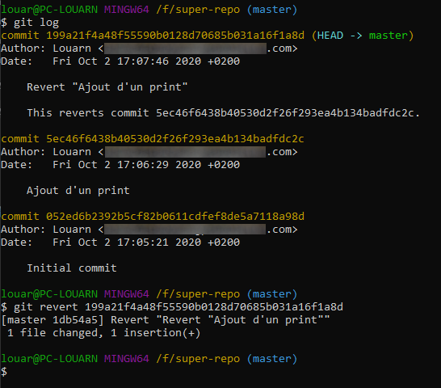
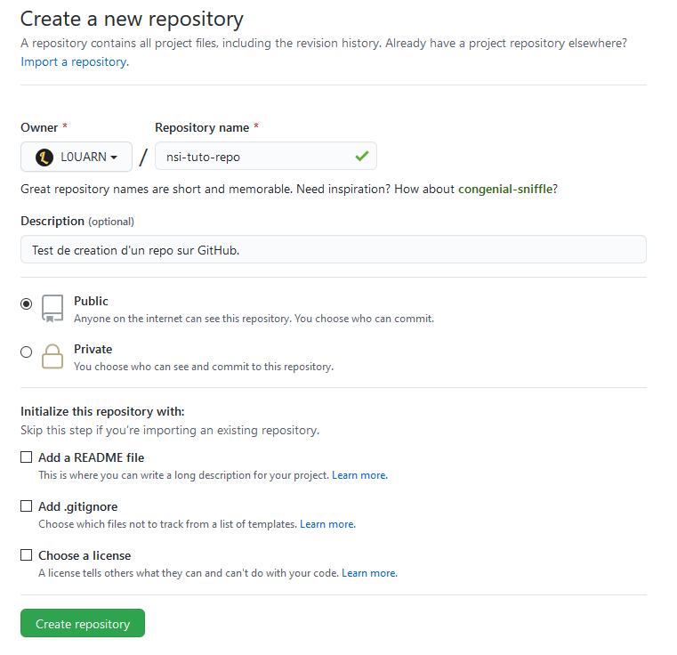
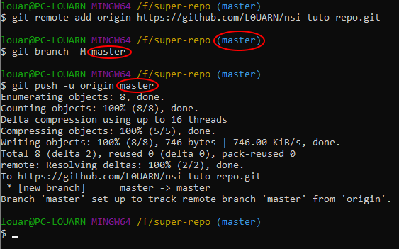
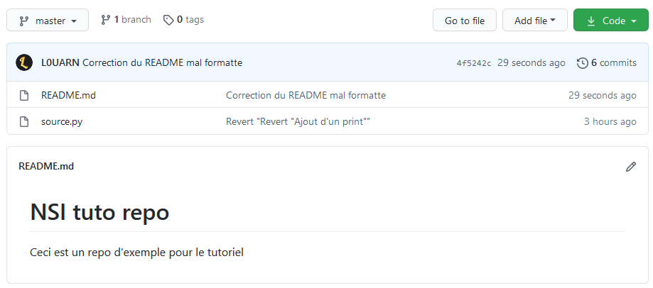

# Utiliser Git et GitHub
**Avec Visual Studio Code en Python depuis une clé USB**

## Préparation
Comme nous allons travailler sur les ordinateurs du lycée, il n'est pas possible
d'installer des logiciels. C'est pour cela que nous allons installer tous les programmes
que nous utiliserons sur une clé USB. Une clé avec une capacité de 4Go est suffisante,
mais il est plus confortable d'avoir plus, si vous voulez pouvoir stoqer plus de choses.

La première chose à faire est de créer 3 dossiers vides **à la base de votre clé**, nommés
"vscode", "git" et "python" respectivement.

Pensez aussi à noter la quelque part lettre de votre clé USB, c'est à dire la lettre
majuscule entre parenthèses qui se trouve à côté du nom de la clé dans l'explorateur de
fichiers Windows.


## Téléchargemements
Nous allons avoir besoin de télécharger 3 logiciels : Visual Studio Code (aussi connu
comme VSCode), un éditeur de texte qui intègre des outils pour travailler avec Git et sur
lequel on peut installer des extensions très utiles ; Git ; et Python, car nos projets
sont en Python.

### Visual Studio Code
Téléchargez VSCode en sélectionnant le fichier .zip 64bits sur
[la page de téléchargement](https://code.visualstudio.com/Download).


### Git
Téléchargez l'installateur en cliquant sur le lien "64bits Git for Windows Portable" sur
[cette page](https://git-scm.com/download/win) (annulez tout éventuel téléchargement qui
se lancerait en ouvrant la page).


### Python
**Ce téléchargement n'est nécessaire que si vous ne l'avez pas déjà installé sur votre
ordinateur, ou que vous utilisez une version qui n'est plus à jour.**

Ouvrez [la page de téléchargements](https://www.python.org/downloads/release/python-385/),
puis cliquez sur le fichier "Windows x86-x64 executable installer".


## Installations
Une fois les 3 fichiers téléchargés, il faut les installer sur votre clé USB.

### Visual Studio Code
Ouvrez le dossier .zip téléchargé, et copiez le contenu dans son enièreté avec `Ctrl+A` et
`Ctrl+C`. Naviguez jusque dans le dossier "vscode" que vous avez précédemment créé dans
votre clé, et collez les fichiers avec `Ctrl+V`.

Une fois cela fait, il faut créer un dossier "data" à côté, de façon à ce que VSCode créé
les fichiers nécessaires à son fonctionnement dans ce dossier au lieu d'essayer de les
créer dans le disque dur de l'ordinateur, ce que nous ne voulons pas car nous voulons une
installation portable.


### Git
Éxécutez le programme d'installation que vous avez téléchargé. Une fois qu'on vous demande
d'entrer un chemin d'installation, choisissez le dossier "git" que vous avez créé plus tôt
sur votre clé.

Ensuite, appuyez sur "OK", et patientez jusqu'à la fin de l'installation. Elle peut
prendre du temps, en fonction de la vitesse de votre ordinateur et de votre clé (surtout
de la clé).


### Python
**Seulement si vous n'avez pas Python d'installé**, lancez le programme d'installation de
Python, et acceptez les paramètres par défaut.

**Dans tous les cas**, cherchez les fichiers créés par l'installation de Python. Ils se
trouvent par défaut dans "C:/Program Files/Python38" si vous avez la version 64bits (vous
devriez), ou dans "C:/Program Files (x86)/Python38" si vous avez la version 32bits. Copiez
le contenu du dossier avec `Ctrl+A` et `Ctrl+C`, puis collez-les dans le dossier "python"
de votre clé prévu à cet effet avec `Ctrl+V`.

## Configurations
Les fichiers nécessaires sont maintenant installés, mais nous ne pouvons pas les utiliser
dans l'état actuel, car il ne sont pas encore configurés pour notre usage.

### Visual Studio Code
Dans le dossier "vscode" de votre clé USB, ouvrez l'éxécutable "Code.exe", afin d'ouvrir
VSCode. Vous pouvez, si vous le souhaitez, créer un raccourci pour ce fichier à la base de
la clé. Le chargement du logiciel peut prendre quelque temps en fonction de la vitesse de
votre clé.

Une fois la page d'acceuil affichée, cliquez sur la petite icone de rouage en bas à
gauche, puis sur le bouton "Settings" du menu qui s'ouvre afin d'accéder aux paramètres.
Une fois sur la page des paramètres, cliquez sur le petit bouton "Open Settings (JSON)"
tout à droite de la barre d'onglets, cela permet d'ouvrir le fichier texte dans lequel les
paramètres sont enregistrés. Nous utilisons cette méthode afin de pouvoir rapidement
copier-coller des paramètres spécifiques, au lieu d'avoir à les chercher.

Entre les deux accolades, entrez les lignes suivantes
```JSON
"git.path": "f:\\git\\bin\\git.exe",
"terminal.integrated.shell.windows": "f:\\git\\bin\\bash.exe",
```

Pensez à changer "f" par la lettre de votre clé USB que vous avez noté plus tôt.

La première ligne permet de changer le chemin dans lequel VSCode va chercher Git, et la
deuxième à changer le programme qui nous sert d'invite de commandes (oui, nous avons
besoin d'utiliser l'invite de commande).

Pour pouvoir programmer confortablement en Python avec VSCode, nous avons besoin
d'installer l'extension du même nom, qui propose de nombreuse fonctionnalités comme la
coloration du code, la mise en évidence des erreurs dans le code, ou la possibiliter de
lancer son programme sans utiliser la ligne de commande.

Pour ce faire, cliquez sur le bouton qui représente 4 carrés dans la barre d'outils à
gauche de la fenêtre, puis, dans la barre de recherche, tapez "Python". Quand les
résultats de votre recherche s'affichent, cliquez sur le bouton vert marqué "Install" de
l'extension Python, faite par Microsoft. Le téléchargement et l'installation peuvent
prendre un peu de temps.

Une fois le texte bleu "Installing" remplacé par un rouage, retournez dans le fichier de
paramètres en cliquant sur l'onglet nommé "settings.json" dans la barre d'onglets en haut
de la fenêtre, et rajoutez la ligne suivante, toujours entre les accolades
```JSON
"python.pythonPath": "f:\\python\\python.exe",
```

Comme précedemment, remplacez le "f" par la lettre de votre clé.


Afin d'initialiser l'extension Python et qu'elle fasse sa première configuration, ouvrez
un fichier python en cliquant sur le bouton "File" puis "Open file" dans la barre d'outils
tout en haut de la fenêtre.

Après un moment de chargement (vous pouvez voir que ça charge dans la barre de status en
bas de la fenètre), un nouvel onglet devrait être ouvert par l'extension Python, que vous
pouvez ignorer et fermer. Ce qui nous intéresse, c'est la notification qui s'affiche en
bas à droite, qui nous dit que nous n'avons pas de linter (un outils qui met en évidence
les erreurs dans le code) d'installé. Cliquez sur le bouton bleu "Select linter" sur cette
notification, et choisissez "pylint" dans la liste qui s'affiche au milieu de l'écran. Une
nouvelle notification devrait apparaître, qui indique que "pylint" n'est pas installé.
Avant de faire quoi que ce soit de plus, appuyez sur `Ctrl+ù` pour ouvrir l'invite de
commande, et seulement après cliquez sur le bouton bleu "Install" de la nouvelle
notification.

Si tout ce passe bien, il y aura un chargement pendant un moment, puis le linter sera
installé et vous pourrez passer à la suite. **Mais**, si un message comme
```
F:\python\python.exe: can't open file 'f:vscodedataextensionsms-python.python-2020.9.112786pythonFilespyvsc-run-isolated.py': [Errno 2] No such file or directory
```
apparaît dans la console, copiez la ligne se trouvant juste au dessus (**sans le $**),
collez-la dans la console, et remplacez tous les `\` par des `/`, puis faites `Entrée`.


### Git
Dans le dossier "git" de votre clé USB, où vous avez installé Git, ouvrez le fichier
"git-bash.exe". Dans la console qui s'ouvre, nous allons entrer 4 commandes afin de
paramétrer Git.
```
git config --global user.name "Votre nom ici"
```
Cette commande permet à Git de connaître votre nom, pour pouvoir vous identifier dans les
fichiers et programmes que vous écriverez ou modifirez.
```
git config --global user.email "votre.email@ici.truc"
```
Pareil, mais pour votre addresse email.
```
alias python="f:/python/python.exe"
```
Le programme "alias" permet de créer des raccourcis dans l'invite de commande, celui-ci
fait en sorte que lorque vous écriverez "python", l'invite de commande comprenne
"f:/python/python.exe", comme ça, vous n'aurez pas à taper le chemin entier de python à
chaque fois que vous voudrez lancer un de vos programmes depuis la ligne de commande.
```
alias pip="f:/python/Scripts/pip.exe"
```
Même chose, mais pour le programme Pip, qui permet d'installer des libraries (ou
bibliothèques) pour Python.



## Git & GitHub
Maintenant que tous les prérequis sont installés, nous allons pouvoir entrer dans le vif
du sujet, c'est à dire l'utilisation de Git et de GitHub.

### Création d'un compte GitHub
Pour commencer à utiliser GitHub, vous allez avoir besoin d'un compte GitHub. Sur votre
navigateur, ouvrez [le site](https://github.com). Vous devriez vous retrouver sur la page
d'acceuil, avec un formulaire d'inscription en plein milieu. Utilisez ce formulaire pour
créer votre compte, et faites attention à utiliser une adresse email **serieuse**, car si
vous travaillez plus tard en temps que développeur, il y a de grande chances que votre
entreprise utilise ce système, ou que vous deviez mettre dans votre CV le lien de votre
compte GitHub.



Complétez le Captcha, puis cliquez sur le bouton bleu "Join a free plan". Sur la prochaine
page, remplissez le questionnaire sur votre activité. Une fois validé, on vous enverra un
email sur l'adresse que vous avez indiqué afin de vérifier votre compte. Vous n'avez plus
qu'à le retrouver, et cliquer sur le lien de validation.

Voilà, votre compte est créé ! Vous pouvez retourner sur
[la page d'acceuil](https://github.com) (vous remarquerez qu'elle a changé, maintenant que
vous êtes connecté), et laisser cet onglet ouvert pour le moment, nous y reviendrons
bientôt.

### Le principe de Git
Jusque là, on vous a demandé de l'installer, mais vous ne savez toujours pas à quoi ça
sert. Git est un outil de "version control" en Anglais, ce qui signifie qu'il aide à gérer
différentes version d'un même projet, de façon à pouvoir garder une trace de tous les
ajouts et modifications que l'on y fait. Cet outil peut aussi être utilisé pour collaborer
sur un projet, de façon plus efficace que de s'envoyer des fichiers entre collaborateurs
et devoir résoudre les conflits quand plusieurs personnes travaillent sur le même fichier.

### Créer un "repo"
Un repo (raccourci de "repository", "dépôt" en Français) est en gros un endroit où l'on
dépose tous les fichiers d'un projet, et où Git va observer les modifications qui s'y
font.

Pour en créer un, il va falloir que vous ouvriez la console "git-bash" (installé dans le
dossier "git" de votre clé USB). Vérifiez dans quel dossier vous vous trouvez avec la
commande `pwd`. Si vous ne vous trouvez pas à la base de votre clé USB, naviguez jusqu'à
la base de votre clé avec la commande `cd`. Une fois là, créez un dossier avec `mkdir`, ce
sera là que se trouvera votre repo. Entrez dans le dossier que vous venez de créer en
utilisant encore une fois `cd`.



Pour initialiser un repo avec Git, il suffit de faire
```
git init
```
dans la console. Cela créera un dossier, caché par défaut, nommé .git. Ne vous préoccupez
pas de son contenu, il ne nous intéresse pas (et vous ne devriez pas y toucher, au risque
de compromettre votre repo).

### Ajouter des fichiers et gérer les changements
Maintenant que votre repo est créé, il serait bien d'y ajouter quelque chose dedans. Pour
commencer, ouvrez VSCode (depuis le fichier "Code.exe" dans le dossier "vscode" de votre
clé). En utilisant le menu "File > Open folder", ouvrez le dossier de votre repo.

Imaginons que vous avez dans votre repo un fichier de code python (créez-en un, par
exemple "source.py") et que vous avez un programme dedans (un simple
`print("Hellow World")` suffira pour le moment). Si vous voulez (et vous le voulez)
ajouter ce fichier à votre repo Git, il suffit d'écrire la commande suivante dans la
console (elle s'ouvre avec `Ctrl+ù` dans VSCode, ou vous pouvez très bien utiliser celle
que vous avez déjà ouvert)
```
git add source.py
```
Si vous avez plusieurs fichiers à ajouter, vous pouvez ajouter les noms de ces fichiers à
la suite comme ceci
```
git add source.py autre_fichier.py une_image.png
```
Ou tout simplement faire ceci, qui ajoutera tous les fichiers du dossier
```
git add .
```
Ajouter un fichier comme ceci permet de confirmer quels fichiers vous allez "commit" au
repo.

Mais c'est quoi un "commit" ? Quand on commit des fichiers, ça veut dire qu'on confirme
leurs changements à Git, et qu'on, en quelque sorte, sauvegarde ses changements à Git.
Pour commit les fichiers que l'on vient d'ajouter, il faut éxécuter la commande suivante
dans la console
```
git commit
```
Lorsque vous éxécutez cette commande, un éditeur de texte assez étrange s'ouvre dans la
console, il s'appelle Vim et est plutôt complique à utiliser. Heuresement qu'on ne s'en
sert seulement pour choisir le message de commit, c'est à dire le commentaire qu'on fait
sur les changements que l'on vient de sauvegarder ! Pour changer ce message, appuyez une
fois sur `I` pour passer en mode insertion de texte, puis écrivez le message que vous
souhaitez sur la première ligne du fichier. Il faut que ce message soit court, et décrive
les changements que vous avez effectués lors de ce commit. Une fois le message écrit,
appuyez une fois sur `Échap`, puis écrivez `:wq` ("w" pour "write", "q" pour "quit"), puis
appuyez sur `Entrée` pour confirmer.



Imaginons (faites un peu plus que ça) que vous faites un nouveau changement dans votre
fichier "source.py", par exemple vous ajoutez une ligne `print("Je suis en spé NSI !")`.
Si vous souhaitez sauvegarder ce changement avec Git, réutilisez la commande `git add`
ainsi que la commande `git commit`, et vos changements seront enregistrés.

### Oups, c'était mieux avant
Bon, jusque là Git semble juste être une méthode un peu "overkill" pour sauvegarder des
fichiers, surtout qu'il faut déjà sauvegarder les fichiers sur son disque dur avant de
pouvoir commit. Mais si je vous vous disait que l'on peut remonter le temps ?

Imaginons que le dernier commit que vous avez fait ne vous plait pas, et que vous
travaillez sur un programme tellement gros que ça serait trop long de juste remettre en
place comme ce que vous aviez avant (dans notre cas c'est juste un `print`, mais vous avez
l'idée). Il vous suffit juste de regarder la liste des commits comme ceci
```
git log
```
Et de repérer la chaine de caractères un peu bizarre au dessus du commit que vous
recherchez. Il s'agit de l'id du commit, et c'est comme cela qu'on l'identifie. Une fois
avoir copié l'id, il suffit de faire comme il suit
```
git revert id
```
Où vous remplacerez "id" par l'id du commit que vous souhaitez "revert". Notez qu'il n'est
pas possible de revert un commit si vous n'avez pas commit les derniers changements que
vous avez fait, c'est à dire qu'il faut toujours ajouter les fichiers et commit avant de
revert. On vous demandera encore ici d'utiliser Vim pour donner un nom au revert.



Sashez qu'il est aussi possible de revert un revert de la meme facon qu'on revert un
commit.



### Mettre en ligne son repo avec GitHub
Pour le moment, vous n'avez travaille avec Git que localement, sur votre propre PC, en
enregistrant les fichiers de votre projet seuelement sur votre disque dur. GitHub est un
service qui vous propose d'heberger sur leurs serveurs vos repos, gratuitement. Grace a
cela, plusieurs personnes peuvent travailler ensemble sur un meme projet.

Pour syncroniser votre repo sur votre ordinateur et un repo heberge sur GitHub, vous allez
tout d'abord devoir en creer un sur votre compte GitHub. Pour ce faire, reouvrez la page
d'acceuil, reconnectez vous si vous vous etes fait deconnectes, puis cliquez sur le bouton
vert a gauche qui vous invite a creer un nouveau repo. On va vous demamder un nom, vous
pouvez vous contenter de "nsi-repo-tuto" ou quelque chose du style pour le moment. Il est
important de noter que vous ne devez jamais utiliser de majuscules, de caracteres
speciaux, ou d'espaces dans les noms de repos. Il faut remplacer les espaces par des
tirets `-`. On vous demamde aussi une description, que vous n'etes pas obliges de fournir.



Une fois avoir valide la creation de votre nouveau repo, on vous redirige sur sa page.
GitHub vous fourni meme un mini tutoriel pour vous expliquer comment mettre en ligne des
fichiers de votre repo local dans ce repo, et c'est ce que nous allons suivre.

Retournez dans VSCode, et creez un nouveau fichier que vous appelerez "README.md" (ce nom
est important). Ce type de fichier s'appelle le mardown (et c'est avec le mardown que
j'ecris ce tutoriel), une sorte de langage, pas de programmation, mais de presentation.
Discord vous propose d'utiliser le mardown dans vos message pour les formatter par
exemple. Dans ce fichier README.md, vous pouvez ecrire quelque chose comme ceci :
```markdown
# NSI Tuto Repo

Ceci est un repo fait pour suivre un tutoriel en classe de NSI
```
L'important, c'est que le fichier ne soit pas vide.

Ensuite, dans GitBash, ou depuis le terminal de VSCode (qu'on a configure pour qu'il soit
un raccourci pour GitBash), que vous pouvez ouvrir avec `Ctrl+ù`, ajoutez README.md au
prochain commit en utilisant la commamde `git add`, puis creez le commit avec
`git commit`.

Retournez sur la page GitHub. Dans la section "…or push an existing repository from the
command line", on vous explique comment faire le lien. Copiez simplement la premiere, puis
la deuxieme, puis la troisieme ligne dans la console. **Faites bien attention que le nom
en bleu qui s'affiche dans votre terminal soit bien le meme que celui que vous ecrivez
pour la troisieme commande**. Si tout a bien marche, une fois la commande numero 3 entree,
une petite fenetre s'ouvrira qui vous demandera de vous connecter avec votre compte
GitHub. Une fois connecte, acceptez toutes les eventuelles demandes qu'on vous jette
dessus, puis vous devriez voire un chargement se faire dans votre terminal, ce qui
signifie que vos fichiers sont en train d'etres transmis sur GitHub.



Une fois le chargement termine, vous pouvez rafraichir la page GitHub, qui devrait
maintenant lister tous les fichiers de votre repo, et le README.md juste en dessous.

Si vous voulez ajouter de nouvelles choses sur votre repo, il suffit maintenant de
modifier les fichiers sur votre PC comme vous le souhaitez, de commit comme vous le feriez
normalement, puis d'entrer la commande
```
git push -u origin master
```
dans votre terminal.


