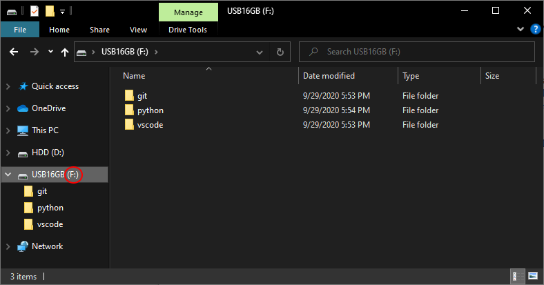

# Utiliser Git et GitHub
**Avec Visual Studio Code en Python depuis une clé USB**

## Préparation
Comme nous allons travailler sur les ordinateurs du lycée, il n'est
pas possible d'installer des logiciels. C'est pour cela que nous
allons installer tous les programmes que nous utiliserons sur une
clé USB. Une clé avec une capacité de 4Go est suffisante, mais il
est plus confortable d'avoir plus, si vous voulez pouvoir stoqer
plus de choses.

La première chose à faire est de créer 3 dossiers vides **à la base
de votre clé**, nommés "vscode", "git" et "python" respectivement.

Pensez aussi à noter la quelque part lettre de votre clé USB, c'est
à dire la lettre majuscule entre parenthèses qui se trouve à côté
du nom de la clé dans l'explorateur de fichiers Windows.



## Téléchargemements
Nous allons avoir besoin de télécharger 3 logiciels : Visual Studio
Code (aussi connu comme VSCode), un éditeur de texte qui intègre 
des outils pour travailler avec Git et sur lequel on peut installer
des extensions très utiles ; Git ; et Python, car nos projets sont
en Python.

### Visual Studio Code
Téléchargez VSCode en sélectionnant le fichier .zip 64bits sur
[la page de téléchargement](https://code.visualstudio.com/Download).


### Git
Téléchargez l'installateur en cliquant sur le lien "64bits Git for
Windows Portable" sur [cette page](https://git-scm.com/download/win)
(annulez tout éventuel téléchargement qui se lancerait en ouvrant
la page).


### Python
**Ce téléchargement n'est nécessaire que si vous ne l'avez pas déjà
installé sur votre ordinateur, ou que vous utilisez une version qui
n'est plus à jour.**

Ouvrez [la page de téléchargements](https://www.python.org/downloads/release/python-385/),
puis cliquez sur le fichier "Windows x86-x64 executable installer".


## Installations
Une fois les 3 fichiers téléchargés, il faut les installer sur votre
clé USB.

### Visual Studio Code
Ouvrez le dossier .zip téléchargé, et copiez le contenu dans son
enièreté avec `Ctrl+A` et `Ctrl+C`. Naviguez jusque dans le dossier
"vscode" que vous avez précédemment créé dans votre clé, et collez
les fichiers avec `Ctrl+V`.

Une fois cela fait, il faut créer un dossier "data" à côté, de façon
à ce que VSCode créé les fichiers nécessaires à son fonctionnement
dans ce dossier au lieu d'essayer de les créer dans le disque dur de
l'ordinateur, ce que nous ne voulons pas car nous voulons une
installation portable.


### Git
Éxécutez le programme d'installation que vous avez téléchargé. Une
fois qu'on vous demande d'entrer un chemin d'installation,
choisissez le dossier "git" que vous avez créé plus tôt sur votre
clé.

Ensuite, appuyez sur "OK", et patientez jusqu'à la fin de
l'installation. Elle peut prendre du temps, en fonction de la
vitesse de votre ordinateur et de votre clé (surtout de la clé).


### Python
**Seulement si vous n'avez pas Python d'installé**, lancez le
programme d'installation de Python, et acceptez les paramètres par
défaut.

**Dans tous les cas**, cherchez les fichiers créés par
l'installation de Python. Ils se trouvent par défaut dans
"C:/Program Files/Python38" si vous avez la version 64bits (vous
devriez), ou dans "C:/Program Files (x86)/Python38" si vous avez
la version 32bits. Copiez le contenu du dossier avec `Ctrl+A` et
`Ctrl+C`, puis collez-les dans le dossier "python" de votre clé
prévu à cet effet avec `Ctrl+V`.

## Configurations
Les fichiers nécessaires sont maintenant installés, mais nous ne
pouvons pas les utiliser dans l'état actuel, car il ne sont pas
encore configurés pour notre usage.

### Visual Studio Code
Dans le dossier "vscode" de votre clé USB, ouvrez l'éxécutable
"Code.exe", afin d'ouvrir VSCode. Vous pouvez, si vous le
souhaitez, créer un raccourci pour ce fichier à la base de la
clé. Le chargement du logiciel peut prendre quelque temps en
fonction de la vitesse de votre clé.

Une fois la page d'acceuil affichée, cliquez sur la petite
icone de rouage en bas à gauche, puis sur le bouton "Settings"
du menu qui s'ouvre afin d'accéder aux paramètres. Une fois
sur la page des paramètres, cliquez sur le petit bouton
"Open Settings (JSON)" tout à droite de la barre d'onglets,
cela permet d'ouvrir le fichier texte dans lequel les
paramètres sont enregistrés. Nous utilisons cette méthode afin
de pouvoir rapidement copier-coller des paramètres spécifiques,
au lieu d'avoir à les chercher.

Entre les deux accolades, entrez les lignes suivantes
```JSON
"git.path": "f:\\git\\bin\\git.exe",
"terminal.integrated.shell.windows": "f:\\git\\bin\\bash.exe",
```

Pensez à changer "f" par la lettre de votre clé USB que vous
avez noté plus tôt.

La première ligne permet de changer le chemin dans lequel
VSCode va chercher Git, et la deuxième à changer le programme
qui nous sert d'invite de commandes (oui, nous avons besoin
d'utiliser l'invite de commande).

Pour pouvoir programmer confortablement en Python avec VSCode,
nous avons besoin d'installer l'extension du même nom, qui
propose de nombreuse fonctionnalités comme la coloration du
code, la mise en évidence des erreurs dans le code, ou la
possibiliter de lancer son programme sans utiliser la ligne
de commande.

Pour ce faire, cliquez sur le bouton qui représente 4 carrés
dans la barre d'outils à gauche de la fenêtre, puis, dans la
barre de recherche, tapez "Python". Quand les résultats de
votre recherche s'affichent, cliquez sur le bouton vert marqué
"Install" de l'extension Python, faite par Microsoft. Le
téléchargement et l'installation peuvent prendre un peu de
temps.

Une fois le texte bleu "Installing" remplacé par un rouage,
retournez dans le fichier de paramètres en cliquant sur
l'onglet nommé "settings.json" dans la barre d'onglets en
haut de la fenêtre, et rajoutez la ligne suivante, toujours
entre les accolades
```JSON
"python.pythonPath": "f:\\python\\python.exe",
```

Comme précedemment, remplacez le "f" par la lettre de votre
clé.


Afin d'initialiser l'extension Python et qu'elle fasse sa
première configuration, ouvrez un fichier python en cliquant
sur le bouton "File" puis "Open file" dans la barre d'outils
tout en haut de la fenêtre.

Après un moment de chargement (vous pouvez voir que ça charge
dans la barre de status en bas de la fenètre), un nouvel onglet
devrait être ouvert par l'extension Python, que vous pouvez
ignorer et fermer. Ce qui nous intéresse, c'est la notification
qui s'affiche en bas à droite, qui nous dit que nous n'avons
pas de linter (un outils qui met en évidence les erreurs dans le
code) d'installé. Cliquez sur le bouton bleu "Select linter" sur
cette notification, et choisissez "pylint" dans la liste qui
s'affiche au milieu de l'écran. Une nouvelle notification devrait
apparaître, qui indique que "pylint" n'est pas installé. Avant de
faire quoi que ce soit de plus, appuyez sur `Ctrl+ù` pour ouvrir
l'invite de commande, et seulement après cliquez sur le bouton
bleu "Install" de la nouvelle notification.

Si tout ce passe bien, il y aura un chargement pendant un moment,
puis le linter sera installé et vous pourrez passer à la suite.
**Mais**, si un message comme
```
F:\python\python.exe: can't open file 'f:vscodedataextensionsms-python.python-2020.9.112786pythonFilespyvsc-run-isolated.py': [Errno 2] No such file or directory
```
apparaît dans la console, copiez la ligne se trouvant juste au dessus
(**sans le $**), collez-la dans la console, et remplacez tous les `\` par
des `/`, puis faites `Entrée`.

// TODO: ajouter une illustration pour l'installation du linter

### Git
Dans le dossier "git" de votre clé USB, où vous avez installé
Git, ouvrez le fichier "git-bash.exe". Dans la console qui
s'ouvre, nous allons entrer 4 commandes afin de paramétrer Git.
```
git config --global user.name "Votre nom ici"
```
Cette commande permet à Git de connaître votre nom, pour pouvoir
vous identifier dans les fichiers et programmes que vous
écriverez ou modiferez.
```
git config --global user.email "votre.email@ici.truc"
```
Pareil, mais pour votre addresse email.
```
alias python="f:/python/python.exe"
```
Le programme "alias" permet de créer des raccourcis dans l'invite
de commande, celui-ci fait en sorte que lorque vous écriverez
"python", l'invite de commande comprenne "f:/python/python.exe",
comme ça, vous n'aurez pas à taper le chemin entier de python à
chaque fois que vous voudrez lancer un de vos programmes depuis la
ligne de commande.
```
alias pip="f:/python/Scripts/pip.exe"
```
Même chose, mais pour le programme Pip, qui permet d'installer des
libraries (ou bibliothèques) pour Python.

